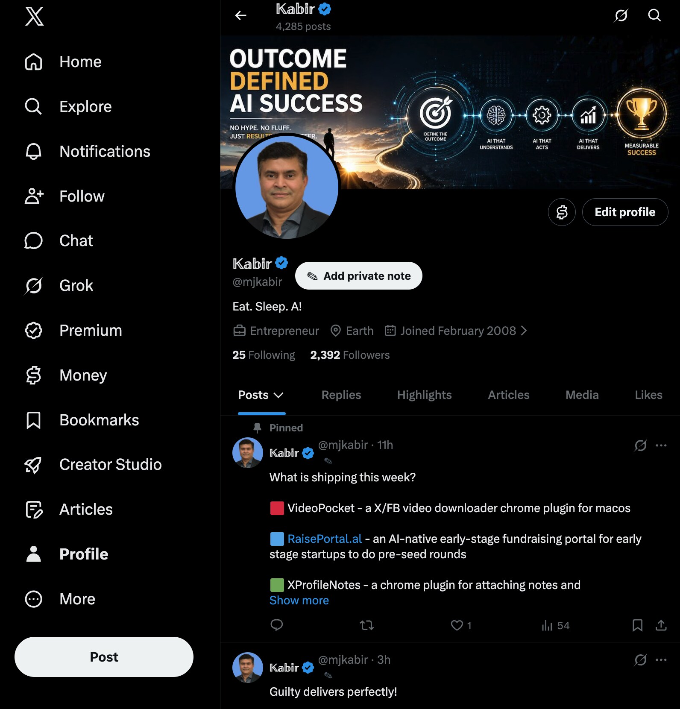
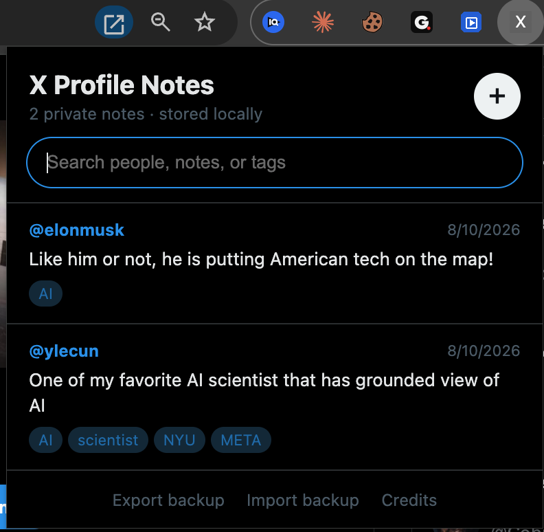

# X Profile Notes

**Remember the person behind the handle.**

A private, local-first Chrome extension for keeping personal notes about people you encounter on X. Nothing is sent to a server, and no account is required.

## See it in action

### Add a private note from any X profile

### Search and manage all saved profile notes

## Features

- Add notes directly from X profile pages.
- Add or view notes from handles in timelines and profile lists.
- Preview existing notes by hovering over the blue pencil.
- Organize people with comma-separated tags.
- Search across handles, notes, and tags.
- Open saved X profiles directly from the notes list.
- Export and import JSON backups.
- Store everything locally in your Chrome profile.

## Install

1. Unzip the download.
2. Open `chrome://extensions` in Chrome.
3. Turn on **Developer mode** in the upper-right corner.
4. Click **Load unpacked**.
5. Select the unzipped `XProfileNotes` folder.
6. Open or refresh `x.com`.

After updating or reloading the extension, refresh any X tabs that were already open. Chrome invalidates the old page script during an extension update.

## Use

- Every profile page has an **Add private note** button beneath the username.
- A small pencil also appears beside X handles in timelines and profile lists.
- Click the pencil to add, edit, tag, or delete a private note.
- Hover over a blue pencil to preview an existing note.
- Click the extension icon to search all notes or add one manually.
- Click any handle in the notes list to open that X profile in a new tab.
- Use **Export backup** regularly. Importing merges a backup with existing notes.

## Credits

Imagined by Mohammed Kabir. Developed by his agents.

Released under the MIT License.

## Privacy

Notes use `chrome.storage.local`. They remain inside this Chrome profile and are not synchronized or transmitted by this extension. Removing the extension can remove its local data, so export a backup first.

## Compatibility

Built for the desktop versions of `x.com` and `twitter.com`. X changes its interface periodically, so future maintenance may be required.

## Project

- [Changelog](CHANGELOG.md)
- [MIT License](LICENSE)
- [Mohammed Kabir on X](https://x.com/mjkabir)
- [Eat. Sleep. AI.](https://eatsleepai.us)
